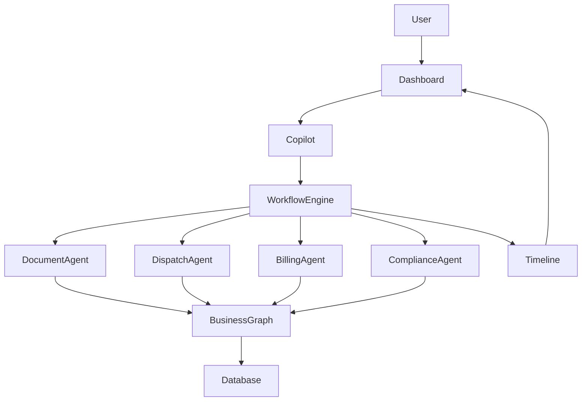

# Owner Operator Copilot OS

# System Diagrams

Version: 1.0

Status: Living Document

---

# Purpose

This document contains visual diagrams describing the architecture of Owner Operator Copilot OS.

Diagrams should evolve as the platform grows.

---

# High-Level System

---

# AI Workflow

---

# Engineering Rule

Every new feature should be represented by an updated system diagram when it changes the overall architecture.